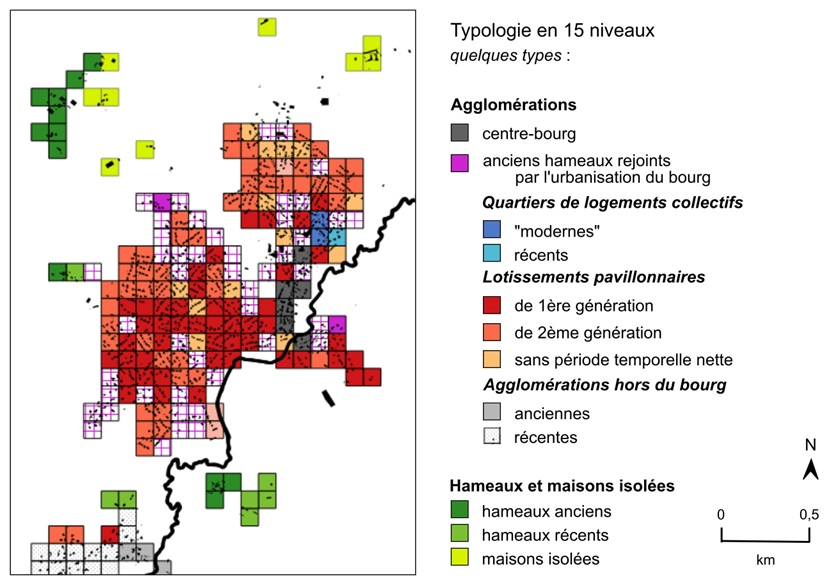

```{r setup, include=FALSE}
knitr::opts_chunk$set(echo = TRUE)
```

## Présentation du projet

Ce dépôt Github vise à élaborer une méthodologie reproductible pour construire un maillage de "quartiers ruraux". Il s'inscrit dans la continuité de mon travail de thèse sur la ségrégation dans les espaces ruraux vendéens (département de l'Ouest de la France). Il "se lance" sous Github dans le cadre d'un atelier de l'école thématique SIGR (du 28 juin au 2 juillet 2021, St-Pierre-d'Oléron).

Dans le cadre de ma thèse, j'ai proposé une méthode pour construire un tel maillage. Cependant, cette méthode était difficilement *reproductible*, dans le sens où le processus méthodologique était *en partie* codé sous R - l'autre partie nécessitant des opérations manuelles sous QGIS. 

Ci-dessous, une illustration du résultat de cette méthode sur le centre de la commune de Dompierre-sur-Yon. Nota Bene : l'entièreté du département vendéen a été ainsi maillé et catégorisé selon cette typologie, de manière automatique. 

- pour plus de détails : Aliette ROUX, 2019. *La ségrégation résidentielle dans les espaces ruraux. Approche critique, méthodologique et étude appliquée à des terrains vendéens*


```{r, echo=FALSE}

```


